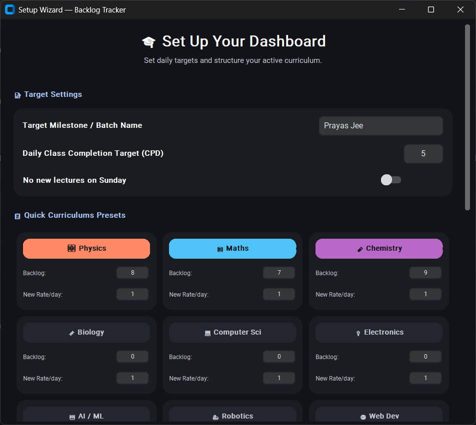

<p align="center">
  
</p>

<p align="center">
  
</p>

<h1 align="center">Backlog Tracker</h1>

<p align="center">A lightweight cross-platform application that helps students calculate, track, and systematically clear academic backlogs.</p>


---

## Features

- Smart backlog clearance calculations
- CPD (Classes Per Day) tracking
- Sunday-aware ETA prediction
- Native analytics visualization
- Motivational productivity prompts
- Time Simulator ( Fast-forward days, weeks, or months )
---
## Screenshots
<p align="center">
  
    
</p>

## Installation

Android Version Code Here: [Android](https://github.com/debojitsantra/BacklogTracker-Android/)

Download the latest release for your platform:

| Platform | Download |
|----------|----------|
| Windows  | [BacklogTracker_Setup.exe](https://github.com/debojitsantra/BacklogTracker/releases/) |
| Linux    | [BacklogTracker_Linux.tar.gz](https://github.com/debojitsantra/BacklogTracker/releases/) |
| macOS    | [BacklogTracker_macOS.zip](https://github.com/debojitsantra/BacklogTracker/releases/) *(untested)* |
| Android | [BacklogTracker-{tag}.apk](https://github.com/debojitsantra/BacklogTracker-Android/releases)|
| Web Version *(unstable)*| [backlogtracker.debojitworkers.qzz.io](https://backlogtracker.debojitworkers.qzz.io/)|

All releases: [github.com/debojitsantra/BacklogTracker/releases](https://github.com/debojitsantra/BacklogTracker/releases/)

<a href="https://apps.microsoft.com/detail/9p112ngslvf0?referrer=appbadge&mode=full" target="_blank"  rel="noopener noreferrer">
	
</a>

### Linux — Emoji Support

If emojis appear as blank squares, install the Noto Color Emoji font:

```bash
sudo apt install fonts-noto-color-emoji -y
```

> Required on Ubuntu/Debian-based distros. Not needed on most modern distros that ship with it by default.

## Local Development

**Install dependencies**
```bash
pip install customtkinter pillow pyinstaller
```

**Run locally**
```bash
python backlog_tracker.py
```

**Build executable**
```bash
pyinstaller --noconfirm --onefile --windowed --add-data "icon.ico;." --icon=icon.ico --name "BacklogTracker" backlog_tracker.py
```

---

## Releases via CI/CD

```bash
git tag v1.0.2
git push origin v1.0.2
```

---

## Author

### Contact Me
* **WhatsApp:** [Chat on WhatsApp](https://wa.me/919622400901)
* **Email:** [amanku26369@gmail.com](mailto:amanku26369@gmail.com)
